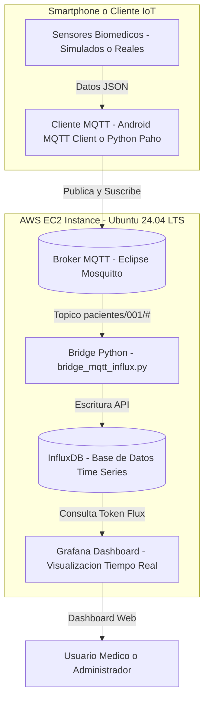

<div align="center">

# 🩺 Monitoreo Remoto de Pacientes (Stack IoT) 

</div>

## 👤 Datos del Alumno

| Campo | Detalle |
|--------|---------|
| **Nombre:** | Gómez Aguilar Jared Emmanuel |
| **Número de Control:** | 22210309 |
| **Materia:** | Sistemas Programables / IoT |
| **Instituto:** | Tecnológico Nacional de México – Campus Tijuana |
| **Fecha:** | 19 Octubre 2025 |
| **Instancia AWS:** | Ubuntu Server 24.04 LTS – EC2 t2.medium |

---

## 🧾 Descripción del proyecto
El proyecto **“Monitoreo Remoto de Pacientes”** implementa una arquitectura completa de **Internet de las Cosas (IoT)** para la captura, transmisión, almacenamiento y visualización en tiempo real de variables biomédicas críticas, tales como **temperatura corporal, saturación de oxígeno (SpO₂)** y **frecuencia cardíaca**. 

Utilizando un ecosistema tecnológico moderno — **MQTT, InfluxDB, Grafana y Python** — el sistema simula la lectura de sensores médicos conectados, publica los datos a través de un **broker MQTT (Mosquitto)**, los almacena en **InfluxDB (base de datos de series temporales)** y los visualiza mediante paneles dinámicos en **Grafana**, permitiendo el monitoreo remoto y continuo del estado fisiológico del paciente.  

- **MQTT** como canal de transmisión de telemetría  
- **InfluxDB 2.x** como base de datos de series temporales  
- **Grafana** para visualización en tiempo real  
- **Python (Paho + InfluxDB client)** como puente y simulador  

El sistema recopila datos de temperatura corporal, saturación de oxígeno (SpO₂) y pulso, los almacena y los muestra en dashboards con colores de alerta basados en rangos clínicos.

La arquitectura desarrollada es **modular, escalable y de código abierto**, lo que facilita su extensión a otros dominios como la salud preventiva, la agricultura inteligente o el monitoreo industrial.  
Su diseño se centra en la **transmisión eficiente, la persistencia de datos confiable** y la **visualización intuitiva**, integrando buenas prácticas de desarrollo, seguridad y documentación profesional.

---

### ⚙️ Objetivos Específicos

1. **Configurar un entorno de comunicación IoT** utilizando el protocolo MQTT con un broker Mosquitto funcional.  
2. **Simular sensores biomédicos** en Python que generen lecturas realistas de temperatura, SpO₂ y pulso cardíaco.  
3. **Implementar un bridge MQTT–InfluxDB** para recibir, procesar y almacenar los datos en tiempo real.  
4. **Visualizar métricas médicas** en paneles personalizados de Grafana con umbrales clínicos de colores.  
5. **Documentar exhaustivamente** cada fase del proceso, asegurando replicabilidad y trazabilidad del proyecto.

---

### 🌐 Alcance

El sistema actualmente simula un paciente (ID: 001), pero el diseño permite escalar fácilmente a múltiples dispositivos, usuarios y organizaciones.  
Se pueden agregar sensores físicos, cifrado TLS, autenticación MQTT, y exportar datos a entornos de análisis o aprendizaje automático.  

> 🧠 *Este proyecto no solo mide datos: los transforma en información médica valiosa para la toma de decisiones en tiempo real.*

---

## 🏗️ Arquitectura del sistema


---

# 🧠 Manual de Ejecución y Supervisión del Sistema

El siguiente bloque resume **todos los comandos relevantes** para volver a poner en marcha el sistema completo, verificar su estado, enviar datos de prueba y visualizar la información en **Grafana**.

---

## ⚙️ 1. Activar los servicios principales del stack IoT

Ejecuta estos comandos para iniciar todos los servicios base (Mosquitto, InfluxDB y Grafana):

```bash
sudo systemctl start mosquitto
```


```bash
sudo systemctl status influxdb
```


```bash
sudo systemctl status grafana-server
```


💡 Si deseas que los servicios se activen automáticamente al arrancar el sistema:

```bash
sudo systemctl enable mosquitto
sudo systemctl enable influxdb
sudo systemctl enable grafana-server
```

Para detenerlos:

```bash
sudo systemctl stop mosquitto influxdb grafana-server
```

---

## 🧰 Instalación y Configuración del Entorno Python (Cliente MQTT)

A continuación se detallan los pasos para configurar el entorno de trabajo en **Ubuntu 24.04 LTS**,  
instalar las dependencias necesarias y crear el **simulador MQTT en Python**.

---

### 🔹 1. Actualizar el sistema e instalar Python 3 + pip

Ejecuta los siguientes comandos para asegurarte de que tu entorno tiene Python 3 y pip correctamente instalados:

```bash
sudo apt update
sudo apt install -y python3 python3-pip
```

Esto asegura que tienes Python y pip listos.

### 🔹 2. Crear un entorno virtual para el proyecto

El entorno virtual permite aislar las dependencias del proyecto y evitar conflictos con otros entornos de Python del sistema.

```
sudo apt install -y python3-venv
python3 -m venv iot-env
```
🧠 El entorno iot-env almacenará todas las librerías necesarias para este proyecto IoT.

### 🔹 3. Activar el entorno virtual

```
source iot-env/bin/activate
```

Cuando veas el prefijo (iot-env) en la línea de comandos, el entorno estará activo.
Todo lo que instales con pip a partir de este momento quedará dentro de este entorno aislado.

Para desactivarlo:

```
deactivate
```

### 🔹 4. Instalar la librería Paho MQTT

Instala la librería oficial de Python para comunicación con brokers MQTT (Eclipse Paho):

```
pip install paho-mqtt
```

Verifica que se haya instalado correctamente:

```
pip show paho-mqtt
```

Deberías obtener una salida similar a:

```
Name: paho-mqtt
Version: 1.6.x
Summary: MQTT client library
```

### 🔹 5. Crear el script del simulador MQTT

Abre un nuevo archivo para el simulador de datos:

```
nano simulador_mqtt.py
```

Dentro del editor, podrás escribir o pegar el código del simulador que publica datos médicos (temperatura, SpO₂ y pulso) hacia tu broker MQTT.

---

## 🩺 Desarrollo del Simulador de Datos Médicos (Cliente MQTT en Python)

Este script genera lecturas simuladas de un paciente (temperatura corporal, saturación de oxígeno y pulso cardíaco)  
y las publica periódicamente en un **Broker MQTT (Mosquitto)**, imitando el funcionamiento de sensores biomédicos reales.

---

```
import paho.mqtt.client as mqtt
import random
import time

# ======== CONFIGURACIÓN DEL BROKER ========
BROKER = "localhost"   # Cambia a la IP de tu instancia o la IP de Tailscale si vas a usarla
PORT = 1883            # Puerto del broker (usa 8883 si tienes TLS activado)
TOPIC_BASE = "pacientes/001"  # ID del paciente simulado

# ======== CREAR CLIENTE MQTT ========
client = mqtt.Client(client_id="SimuladorSensor001")

# Si tu broker tiene usuario y contraseña, descomenta esto:
# client.username_pw_set("usuario", "contraseña")

# ======== CONEXIÓN AL BROKER ========
print(f"Conectando al broker MQTT {BROKER}:{PORT} ...")
client.connect(BROKER, PORT, keepalive=60)
client.loop_start()
print("Conexión exitosa ✅")

# ======== SIMULADOR DE DATOS ========
try:
    while True:
        temperatura = round(random.uniform(36.0, 38.5), 2)
        spo2 = random.randint(90, 100)
        pulso = random.randint(60, 100)

        client.publish(f"{TOPIC_BASE}/temperatura", temperatura, qos=1)
        client.publish(f"{TOPIC_BASE}/spo2", spo2, qos=1)
        client.publish(f"{TOPIC_BASE}/pulso", pulso, qos=1)

        print(f"Publicado → Temp: {temperatura}°C | SpO2: {spo2}% | Pulso: {pulso} bpm")
        time.sleep(5)

except KeyboardInterrupt:
    print("Finalizando simulador...")
    client.loop_stop()
    client.disconnect()
```
---

### 🔹 Explicación del Código

| Sección | Descripción |
|----------|--------------|
| **Importación de librerías** | `paho.mqtt.client` gestiona la conexión MQTT, `random` genera valores aleatorios y `time` controla los intervalos de envío. |
| **Configuración del Broker** | Se define la dirección del broker MQTT (`localhost` si se ejecuta en el mismo servidor, o IP de Tailscale si es remoto). |
| **Cliente MQTT** | Se crea una instancia del cliente con un `client_id` identificando el simulador (por ejemplo, `SimuladorSensor001`). |
| **Conexión al broker** | Se conecta al servidor MQTT en el puerto 1883 y se inicia el loop de comunicación con `loop_start()`, manteniendo la sesión activa. |
| **Simulación de datos** | En un ciclo infinito (`while True`), se generan valores aleatorios dentro de rangos fisiológicos normales: |
|  | • **Temperatura corporal:** entre `36.0` y `38.5 °C` |
|  | • **Saturación de oxígeno (SpO₂):** entre `90 %` y `100 %` |
|  | • **Pulso cardíaco:** entre `60` y `100 bpm` |
| **Publicación de mensajes** | Cada valor se publica en su tópico MQTT correspondiente: `pacientes/001/temperatura`, `pacientes/001/spo2`, y `pacientes/001/pulso`. |
| **Control del ciclo** | `time.sleep(5)` define el intervalo de envío de datos (cada 5 segundos). Puedes modificar este valor para mayor o menor frecuencia. |
| **Interrupción manual** | Si presionas `Ctrl + C`, el programa captura la interrupción con `KeyboardInterrupt`, detiene el loop y cierra la conexión limpiamente con `disconnect()`. |
| **QoS (Quality of Service)** | Se utiliza **QoS 1**, lo que garantiza que cada mensaje publicado llegue al menos una vez al broker MQTT, aumentando la confiabilidad. |
| **Extensión futura** | Se puede agregar autenticación con usuario y contraseña o cifrado TLS (puerto 8883) para mejorar la seguridad en la transmisión. |

---

## 🧪 Ejecución del Simulador MQTT y Evidencias

Una vez configurado todo el entorno, ejecuta el simulador con el siguiente comando:

```bash
python3 simulador_mqtt.py
```

Si la conexión con el broker MQTT (Mosquitto) fue exitosa, verás una salida similar en la terminal:

Conectando al broker MQTT localhost:1883 ...
Conexión exitosa ✅
Publicado → Temp: 36.74°C | SpO2: 97% | Pulso: 79 bpm
Publicado → Temp: 37.21°C | SpO2: 95% | Pulso: 82 bpm
...

## 🧪 Ejecución del Simulador MQTT y Evidencia

La siguiente imagen muestra la ejecución del simulador MQTT en la terminal,
enviando lecturas simuladas de temperatura, SpO₂ y pulso hacia el broker.


---

## 🧩 Comunicación Bidireccional – MQTT Publicador y Suscriptor

En esta captura se observan ambas terminales trabajando simultáneamente:

* **Derecha:** Ejecución del comando ```python3 simulador_mqtt.py (publicador).```

* **Izquierda:** Ejecución del comando ```mosquitto_sub -t "pacientes/001/#" -v (suscriptor).```


Esto demuestra el flujo correcto de datos del cliente simulador hacia el broker MQTT,
y su recepción en tiempo real por los suscriptores.

💡 El cuadro resaltado indica el intercambio activo de mensajes MQTT, evidenciando la comunicación funcional.

---

## 🌐 Arquitectura MQTT en acción

En el sistema se usan dos instancias diferenciadas, mostrando el comportamiento del modelo cliente-servidor.

### 🖥️ Instancia 1 → Mosquitto Broker (Servidor Central)

Aquí se ejecuta el broker MQTT que recibe y distribuye los mensajes de los clientes.


🔁 El broker actúa como intermediario, asegurando la entrega de mensajes entre todos los clientes conectados.

### 📲 Instancia 2 → Simulador MQTT (Cliente Remoto)


Desde esta instancia se ejecuta el simulador en Python, encargado de enviar lecturas periódicas al broker.

✅ Cada envío corresponde a una lectura biomédica enviada exitosamente y almacenada después en InfluxDB mediante el bridge Python.

---

## 💾 Integración con InfluxDB – Base de Datos de Series Temporales

Una vez establecida la comunicación MQTT, el siguiente paso es **persistir los datos** en una base de datos optimizada para series temporales.  
En este caso, se utiliza **InfluxDB 2.x**, ejecutado dentro de la misma instancia AWS Ubuntu 24.04 LTS.

---

### ⚙️ Verificación del Servicio InfluxDB 

Al ingresar desde el navegador en la dirección http://<IP>:8086, se accede al panel principal de InfluxDB. 
Inicialmente, el bucket aparece vacío antes de realizar la primera inserción de datos desde el script Python.


💡 Aquí se gestionan los buckets, tokens, organizaciones y las consultas con lenguaje Flux. 
   
---

Antes de conectar el bridge MQTT con InfluxDB, activa el entorno virtual y añade la librería oficial:

```
source ~/iot-env/bin/activate
pip install influxdb-client
```
    
🧠 El paquete influxdb-client permite enviar datos a InfluxDB 2.x mediante la API oficial, con autenticación por token.

---
### ⚙️ Verificación del Servicio InfluxDB 
    
Abre el archivo del bridge que será responsable de recibir los datos publicados por el simulador
y almacenarlos en el bucket configurado:
   
```
nano simulador.py
```  
En este script se implementa el cliente MQTT y la conexión con InfluxDB para escribir datos en tiempo real.
La estructura incluye:

* Suscripción al tópico pacientes/001/#.

* Conversión del payload recibido a valores numéricos.

* Creación de puntos InfluxDB con etiquetas (paciente) y campos (temperatura, spo2, pulso).

* Escritura automática de cada lectura en la base de datos.
```
# simulador.py
import os
import warnings
import time
import random
from datetime import datetime
import paho.mqtt.client as mqtt
from influxdb_client import InfluxDBClient, Point, WriteOptions

warnings.filterwarnings("ignore", category=DeprecationWarning)

# ======== CONFIGURACIÓN MQTT ========
BROKER = "localhost"
PORT = 1883
TOPIC = "pacientes/001/#"

# ======== CONFIGURACIÓN INFLUXDB ========
INFLUX_URL = "http://localhost:8086"
INFLUX_TOKEN = "TOKEN_INFLUXDB"
INFLUX_ORG = "SistemasProgramables"
INFLUX_BUCKET = "bucket"

# ======== CONFIGURACIÓN DEL BRIDGE ========
INTERVALO_SIMULACION = 15  # segundos
ULTIMO_MENSAJE = time.time()

# ======== CONEXIÓN A INFLUXDB ========
try:
    client_influx = InfluxDBClient(url=INFLUX_URL, token=INFLUX_TOKEN, org=INFLUX_ORG)
    write_api = client_influx.write_api(write_options=WriteOptions(batch_size=1))
    print("✅ Conexión establecida con InfluxDB")
except Exception as e:
    print(f"❌ Error conectando a InfluxDB: {e}")
    exit(1)

# ======== FUNCIÓN PARA ESCRIBIR DATOS ========
def escribir_dato(metric, value, paciente="001"):
    try:
        point = (
            Point("signos_vitales")
            .tag("paciente", paciente)
            .field(metric, value)
            .time(datetime.utcnow())
        )
        write_api.write(bucket=INFLUX_BUCKET, record=point)
        print(f"💾 Guardado en InfluxDB → {metric}: {value}")
    except Exception as e:
        print(f"⚠️ Error escribiendo en InfluxDB: {e}")

# ======== CALLBACK MQTT ========
def on_message(client, userdata, msg):
    global ULTIMO_MENSAJE
    payload = msg.payload.decode("utf-8").strip()
    parts = msg.topic.split("/")
    paciente = parts[1] if len(parts) > 1 else "desconocido"
    metric = parts[2] if len(parts) > 2 else None

    if metric is None:
        print(f"⚠️ Mensaje sin métrica: {msg.topic} = '{payload}' → ignorado.")
        return

    try:
        value = float(payload)
        escribir_dato(metric, value, paciente)
        ULTIMO_MENSAJE = time.time()
    except ValueError:
        print(f"⚠️ Valor inválido recibido → {msg.topic}: '{payload}' (ignorado)")

# ======== MQTT CLIENT ========
mqtt_client = mqtt.Client(client_id="BridgeInflux001")
mqtt_client.on_message = on_message

try:
    mqtt_client.connect(BROKER, PORT, keepalive=60)
    mqtt_client.subscribe(TOPIC, qos=1)
    print(f"📡 Suscrito al tópico: {TOPIC}")
except Exception as e:
    print(f"❌ Error conectando al broker MQTT: {e}")
    exit(1)

mqtt_client.loop_start()

# ======== SIMULADOR AUTOMÁTICO ========
try:
    while True:
        tiempo_actual = time.time()
        # Si no han llegado mensajes en INTERVALO_SIMULACION segundos, generar datos simulados
        if tiempo_actual - ULTIMO_MENSAJE > INTERVALO_SIMULACION:
            temperatura = round(random.uniform(36.0, 38.0), 2)
            spo2 = random.randint(92, 100)
            pulso = random.randint(60, 100)

            print("🩺 No se detectaron datos recientes — generando simulación...")
            escribir_dato("temperatura", temperatura)
            escribir_dato("spo2", spo2)
            escribir_dato("pulso", pulso)
            ULTIMO_MENSAJE = tiempo_actual

        time.sleep(3)
except KeyboardInterrupt:
    print("🚪 Programa finalizado por el usuario.")
    mqtt_client.loop_stop()
    client_influx.close()

```

### 📊 Resultado – InfluxDB con Datos Recibidos

Una vez ejecutado el bridge (python3 simulador.py), los datos del simulador comienzan a registrarse automáticamente.


📈 Se observan los datos de temperatura, SpO₂ y pulso registrados en el bucket “bucket”, confirmando la persistencia correcta de la información.

---
    
## 🧩 Ejecución del Bridge MQTT → InfluxDB y Evidencia de Persistencia de Datos

Una vez configurado el bridge `simulador.py`, se ejecuta el siguiente comando para iniciar la transferencia de datos en tiempo real desde el broker MQTT hacia la base de datos InfluxDB:
    
```bash
python3 simulador.py
```
    
Durante la ejecución, se observan los mensajes que confirman la simulación de los datos médicos y su escritura en la base de datos.

## 🧩 Ejecución del Bridge MQTT → InfluxDB y Evidencia de Persistencia de Datos    

En la siguiente imagen se puede ver la instancia de Ubuntu en AWS ejecutando el bridge Python,
simulando los datos de temperatura, SpO₂ y pulso, y confirmando la recepción exitosa de cada medición.
    

    
⚙️ Cada línea indica que un conjunto de valores ha sido publicado por el simulador MQTT y almacenado correctamente en InfluxDB.

## 📊 Verificación de Datos en InfluxDB 
   
Las siguientes capturas evidencian cómo los datos simulados se registran dentro del bucket configurado en InfluxDB,
correspondientes a los tres parámetros monitoreados: pulso, SpO₂ y temperatura corporal.

💓 Datos de Pulso 
    


💡 Cada punto representa una lectura del pulso cardíaco (en BPM) enviada por el simulador y registrada en el bucket.  
 
🫁 Datos de Saturación de Oxígeno (SpO₂)
    

    
📈 Se observa la variación natural de las lecturas simuladas de SpO₂, con valores entre 90 % y 100 %, confirmando la persistencia en tiempo real.

🌡️ Datos de Temperatura Corporal
    


🔥 Lecturas generadas por el simulador de temperatura corporal (rango 36.0 °C – 38.5 °C). Cada registro es enviado al broker MQTT y almacenado automáticamente por el bridge.

## 📲 Verificación Adicional desde MQTT Client
Para comprobar la bidireccionalidad del sistema, se realizó una prueba directa desde la aplicación móvil MQTT Client.
Antes de que transcurrieran los 15 segundos de espera del simulador, se enviaron datos manuales al tópico correspondiente.
     

    
📡 Los valores publicados manualmente fueron recibidos y almacenados correctamente, demostrando la robustez del canal MQTT.
 
## 🧾 Identificación de Datos Manuales
En esta imagen se destacan los puntos manuales que fueron enviados directamente desde el cliente MQTT, diferenciándolos de los generados automáticamente por el simulador.


🧠 Esta evidencia demuestra que el sistema IoT no solo almacena datos automáticos del simulador, sino también lecturas ingresadas manualmente desde cualquier cliente MQTT autenticado.
    
---

## 📊 Integración con Grafana – Visualización en Tiempo Real
    
Con los datos ya almacenados en InfluxDB, la etapa final del proyecto consiste en visualizar las métricas biomédicas (temperatura, SpO₂ y pulso) en **Grafana**, generando paneles tipo *Gauge* que reflejan el estado del paciente en tiempo real.

---
    
## 🧭 Interfaz de Inicio de Grafana
Accede desde el navegador a:
    
```bash
http://<IP_PUBLICA>:3000
```
Inicio de sesión por defecto:
* **Usuario:** admin
* **Contraseña:** admin (se recomienda cambiarla al primer acceso)
 
🧠 Grafana ofrece una interfaz moderna, ideal para crear dashboards IoT personalizados con datos provenientes de InfluxDB.
    


## 🧩 Conexión entre Grafana e InfluxDB
 
En el menú lateral de Grafana, ve a Configuration → Data Sources → Add data source,
y selecciona InfluxDB. Configura los siguientes parámetros:
    

    
| Campo              | Valor                   |
| ------------------ | ----------------------- |
| **Query Language** | Flux                    |
| **URL**            | `http://localhost:8086` |
| **Organization**   | `SistemasProgramables`  |
| **Token**          | (tu token de InfluxDB)  |
| **Default Bucket** | `bucket`                |    
    
💡 Se selecciona Flux porque InfluxDB 2.x utiliza este nuevo lenguaje de consultas.

Al hacer clic en Save & Test, debe aparecer el mensaje:
    
 ```bash
Data source is working
```

    
✅ Grafana ahora está conectado correctamente con la base de datos InfluxDB.
    
 ## 📈 Creación de Paneles y Consultas Flux
    
En los paneles tipo Gauge, se configuraron los siguientes umbrales clínicos:
    
 | Métrica         | Unidad | Rango  | Colores                        |
| --------------- | ------ | ------ | ------------------------------ |
| 🌡️ Temperatura | °C     | 35–40  | Verde / Amarillo / Rojo        |
| 🫁 SpO₂         | %      | 80–100 | Rojo / Amarillo / Verde        |
| 💓 Pulso        | bpm    | 40–130 | Azul / Verde / Amarillo / Rojo |
    
## 📈 Interpretación Clínica de los Paneles Gauge en Grafana
    
Cada panel del dashboard en Grafana representa una variable fisiológica crítica.  
Los colores de los medidores (*Gauge Panels*) indican los **umbrales clínicos** definidos con base en valores normales del cuerpo humano.  
Esta clasificación permite detectar de forma visual si un paciente se encuentra estable o en riesgo.
    
### 🌡️ Temperatura Corporal (°C)

| Rango | Color | Significado | Interpretación |
|--------|--------|-------------|----------------|
| **35.0 – 37.5 °C** | 🟩 Verde | Normal | Temperatura corporal estable. |
| **37.6 – 38.5 °C** | 🟨 Amarillo | Fiebre leve | Posible respuesta inmunológica, infección o inflamación leve. |
| **> 38.5 °C** | 🟥 Rojo | Fiebre alta / riesgo | Requiere vigilancia médica; indica posible infección activa. |

> 💡 *El rango normal de temperatura corporal en adultos oscila entre 36.0 y 37.4 °C.*
    
---
    
### 🫁 Saturación de Oxígeno (SpO₂ %)

| Rango | Color | Significado | Interpretación |
|--------|--------|-------------|----------------|
| **95 – 100 %** | 🟩 Verde | Normal | Oxigenación adecuada en sangre. |
| **91 – 94 %** | 🟨 Amarillo | Leve hipoxia | Posible dificultad respiratoria o fatiga. |
| **80 – 90 %** | 🟥 Rojo | Hipoxia moderada/grave | Riesgo alto; requiere intervención médica. |
| **< 80 %** | ⚫ Negro | Crítica | Falta severa de oxígeno; situación potencialmente mortal. |

> 🩸 *En pacientes con COVID-19 o enfermedades pulmonares, valores < 94 % son una alerta de desaturación.*

---
                                                                       
### 💓 Frecuencia Cardíaca (Pulso - bpm)

| Rango | Color | Significado | Interpretación |
|--------|--------|-------------|----------------|
| **60 – 100 bpm** | 🟩 Verde | Normal | Ritmo cardíaco saludable en reposo. |
| **40 – 59 bpm** | 🟦 Azul | Bradicardia | Ritmo lento; puede ser normal en atletas, o indicar disfunción cardíaca. |
| **101 – 120 bpm** | 🟨 Amarillo | Taquicardia leve | Estrés, fiebre o deshidratación. |
| **> 120 bpm** | 🟥 Rojo | Taquicardia severa | Emergencia médica; posible insuficiencia cardíaca o shock. |

> ❤️ *El pulso normal en reposo varía según la edad y condición física, pero 60–100 bpm es el rango general saludable.*
    
### 🔎 Conclusión Clínica de los Rangos

- **Verde → Estabilidad fisiológica:** el paciente se encuentra dentro de parámetros normales.  
- **Amarillo → Vigilancia preventiva:** cambios leves que pueden indicar inicio de complicación.  
- **Rojo → Alerta médica:** condición potencialmente peligrosa; debe atenderse.  
- **Azul/Negro → Estado crítico:** requiere atención inmediata o reevaluación del sensor.

---

Evidencia de la creación de las gráficas con las consultas Flux:
    


## 🔄 Gráficos Dinámicos – Datos en Tiempo Real
En las siguientes imágenes se evidencia cómo los valores de los sensores varían dinámicamente,
reflejándose instantáneamente en los paneles de Grafana.
    


🔁 Los paneles se actualizan automáticamente cada 5 segundos, mostrando lecturas en tiempo real desde el bridge MQTT.
    
    
 ## 🧭 Conclusión Final

El proyecto **Monitoreo Remoto de Pacientes** demostró la integración funcional del **stack IoT moderno** compuesto por:

**MQTT → InfluxDB → Grafana**

A través de este desarrollo se logró establecer un flujo continuo de información:
1. **Captura y simulación de datos médicos** mediante sensores virtuales en Python.  
2. **Transmisión eficiente y confiable** a través del protocolo MQTT usando el broker Mosquitto.  
3. **Persistencia estructurada de datos** en InfluxDB, optimizada para series temporales.  
4. **Visualización dinámica y analítica** en Grafana, con paneles en tiempo real y umbrales clínicos.

---

### 🌐 Impacto y Alcance Tecnológico

Esta arquitectura IoT no solo permite el monitoreo remoto de pacientes,  
sino que puede **adaptarse fácilmente a múltiples escenarios de la vida real**, tales como:

- 🏭 **Monitoreo industrial:** control de temperatura, vibración o humedad en plantas de producción.  
- 🌱 **Agricultura inteligente:** seguimiento del nivel de humedad del suelo, luz y nutrientes.  
- 🏠 **Domótica:** registro de consumo eléctrico, seguridad y confort en viviendas inteligentes.  
- 🚗 **Vehículos conectados:** análisis de rendimiento de motores o sensores de distancia en tiempo real.  
- 🌡️ **Salud preventiva:** detección temprana de anomalías fisiológicas en pacientes crónicos.

La escalabilidad del modelo permite incorporar nuevos sensores, seguridad TLS, alertas automáticas,  
e incluso algoritmos de **inteligencia artificial** para predicciones y diagnósticos tempranos.

---

### 🧠 Reflexión Técnica

Durante la implementación se reforzaron conocimientos clave en:
- Protocolos IoT (MQTT)  
- Manejo de bases de datos temporales (InfluxDB)  
- Dashboards y analítica en tiempo real (Grafana)  
- Programación Python orientada a conectividad y automatización  

Este ejercicio práctico consolida una base sólida para futuros proyectos de **telemetría, análisis de datos y sistemas distribuidos**,  
posicionando al desarrollador como capaz de diseñar e implementar infraestructuras IoT modernas, escalables y seguras.

---

### 🚀 Conclusión General

La experiencia demuestra que las tecnologías IoT representan una herramienta poderosa  
para **digitalizar, automatizar y mejorar la toma de decisiones en entornos reales**.  

El mismo principio que permitió monitorear los signos vitales de un paciente  
puede ser aplicado para construir **ciudades inteligentes, redes energéticas sostenibles o sistemas médicos interconectados**.  

> 💡 *El Internet de las Cosas no solo conecta dispositivos: conecta información, decisiones y personas.*

 
